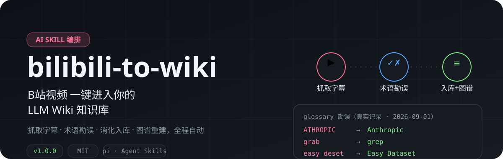
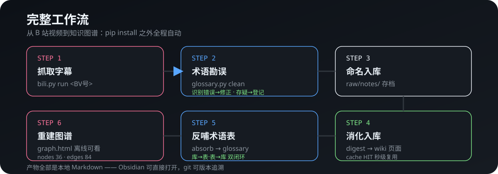

# bilibili-to-wiki

<p align="center">
  
</p>

**一句话**：把 B 站视频变成持续积累、可查询的 LLM Wiki 知识库素材——抓取、勘误、消化、反哺、图谱五步全自动，全程本地 Markdown。

---

## 它解决什么问题

| 痛点 | 说明 |
|------|------|
| **跨会话失效** | 手动把「B站视频→知识库」的流程告诉 agent 只对当次对话有效，换会话就丢了 |
| **触发词重叠** | 说「把视频入库」时，bilibili-learn（只会出报告）或 llm-wiki（不会抓 B 站）可能误接管 |
| **字幕噪声** | B 站字幕/Whisper 转写有识别错误（`ATHROPIC→Anthropic`），不校验会污染知识库 |

---

## 真实证明

<p align="center">
  
</p>

- **勘误是真实的**：`glossary.json._aliases` 内存放着本仓库实测的 4 条映射（ATHROPIC→Anthropic / grab→grep / AH 的目录→agent 的目录 / easy deset→Easy Dataset，最后一条由「B站模糊搜索→同一UP主新视频」联想确认）
- **复用是真的**：同一素材二次 ingest 走 `cache HIT` 短路——秒级跳过，`wiki` 页面零重复、零 LLM 调用
- **产物可审计**：全部页面是带 front matter 的 Markdown + `graph-data.json` + 离线 HTML 图谱

---

## 如何使用

### 前置

```bash
# 克隆本 skill 与两个依赖 skill
git clone https://github.com/getfunWindz/bilibili-to-wiki.git ~/.pi/agent/skills/bilibili-to-wiki

# 知识库需已初始化（llm-wiki skill 的 init 一步完成）
cat ~/.llm-wiki-path   # 应输出知识库路径，如 C:\Users\xx\llm-wiki-kb
```

依赖：`bilibili-learn`（抓取 + glossary）、`llm-wiki`（digest + 图谱）、`jq`、`Node.js`。

### 使用（pi 里说一句）

```
「把 BV1RkFAznESD 加进知识库」
「消化这个 B 站视频」
```

### 手动路径

```bash
bash scripts/ingest-pipeline.sh <视频链接/BV号>   # 抓取+勘误（输出 corrected 稿）
# 然后 agent 执行：复制到 raw/notes/ → llm-wiki digest → absorb → 重建图谱
```

---

## 工作流详解（为什么这样设计）

```
┌─────────────────────────────────────────────────────────┐
│  ①抓取  bili.py run（字幕优先，Whisper 兜底）            │
│  ②勘误  glossary.py clean（_aliases 替换 + 存疑登记）     │
│  ③入库  复制 corrected 稿 → raw/notes/（带 front matter）│
│  ④消化  cache check？ MISS→digest（Step1→页面）           │
│         │                    │                          │
│         │                    └ HIT→复用（零 LLM 调用）   │
│  ⑤反哺  glossary.py absorb（实体/主题新术语 → 术语表）    │
│  ⑥图谱  build-graph-data.sh + build-graph-html.sh        │
└─────────────────────────────────────────────────────────┘
```

**三种编排形态**：

| 形态 | 触发 | 说明 |
|------|------|------|
| 全新流程 | 素材首次 digest | 完整六步 |
| 复用流程 | 素材已 digest | cache HIT 短路，秒级 |
| 批量 | 收藏夹 `favs-scan` → 逐个走全新 | 每 3 个暂停确认 |

---

## Glossary 双向闭环（设计核心）

```
表 → 库（正用）：ingest 前 glossary.py clean —— 替换已知识别错误
                    ▲                    │
         （回填 correct 格式）    （新术语 / 新勘误）
                    │                    ▼
库 → 表（反哺）：digest 后 glossary.py absorb —— 实体页新概念沉淀回术语表
```

`glossary.json` 扩展结构（向后兼容，旧术语不变）：

```json
{
  "Anthropic": "AI 公司…",
  "_aliases": {
    "ATHROPIC": {"correct": "Anthropic", "type": "stt_error"},
    "easy deset": {"correct": "Easy Dataset", "type": "stt_error"}
  }
}
```

`type`：`stt_error`（语音/字幕识别错误）| `naming`（译名统一）| `uncertain`（存疑，correct=null）

### glossary.py 命令

```
list                             列出术语库
add <术语> <解释>                沉淀术语（已有不覆盖）
check <报告.md> <subtitle.txt>   注释/覆盖校验
alias <错误> <标准>              登记勘误
aliases                          列出勘误映射
clean <文件> [--out <dst>]       按勘误映射替换
absorb <wiki目录> [--dry]        反哺沉淀新术语
```

---

## 边界与已知实践

- **适用**：个人知识库、资料持续增长、B站视频作为学习素材的场景
- **不适用**：一次性问答（不需要整套治理）、大规模低价值语料粗筛（应先 RAG）
- **已知坑（已在代码中修复）**：① 桥接脚本不要自己猜文件名（曾截断成 `RA.md`）② `--no-whisper` 空参数会破坏参数解析
- **存疑机制**：不确定的术语**不自动替换**，进 `uncertain` 队列人工确认——不过度自动化

## 目录结构

```
bilibili-to-wiki/
├── SKILL.md                     # Skill 主文件（触发/排除/工作流/错误分支表）
├── README.md                    # 本文件
├── assets/readme/               # 视觉资产（hero / workflow SVG）
└── scripts/
    └── ingest-pipeline.sh       # 抓取+勘误（命名与 digest 由 agent 执行）
```

## 相关链接

- Karpathy [LLM Wiki 方法论 gist](https://gist.github.com/karpathy/442a6bf555914893e9891c11519de94f)
- [sdyckjq-lab/llm-wiki-skill](https://github.com/sdyckjq-lab/llm-wiki-skill)（知识库引擎，本 skill 的依赖）
- 本仓库依赖：`bilibili-learn`（作者自研 B 站学习视频 skill，含 glossary）

## License

MIT © getfunWindz
